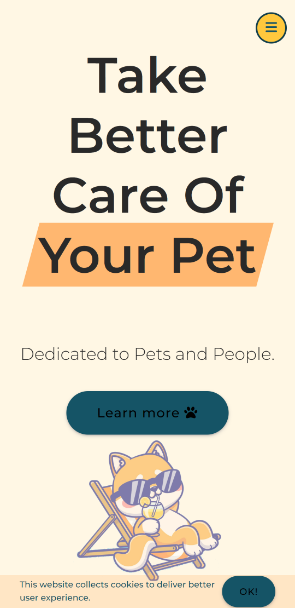
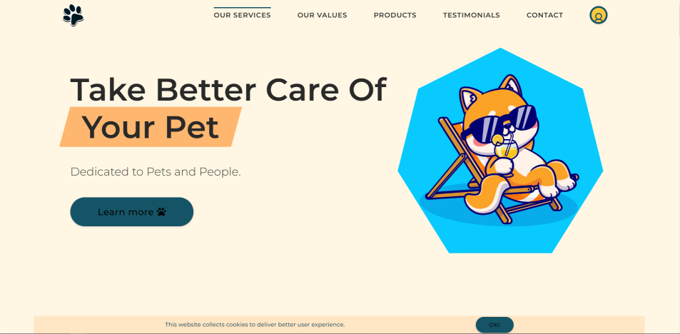

# CuddlePaws

*CuddlePaws* is a simple and elegant pet care website built using HTML, CSS, and JavaScript. It provides an engaging user experience and showcases services such as grooming, veterinary checkups, pet sitting, and more.

## Features

- Responsive and attractive design
- Smooth navigation through sections: Home, Services, About, and Contact
- Hero banner with a compelling call-to-action
- Clickable button interaction using JavaScript
- Clean and organized code structure

## Live Demo

[View Website](#) — (Add your GitHub Pages or deployment link here)

## Screenshots

## Technologies Used

- HTML5
- CSS3
- JavaScript (Vanilla)*

### Project summary/ observations

- CuddlePaws is a front-end web project that provides a warm and inviting online presence for a pet care service. Designed with simplicity and love, the website showcases key services, introduces the team, and offers contact details for pet owners looking for reliable grooming, sitting, and veterinary support. Built using HTML, CSS, and JavaScript, it’s a great example of a responsive and beginner-friendly web project.
- It should certainly start with the mobile view. The transition from desktop to mobile gave me a problem. It's not perfect, but I wasn't focusing too much on it.

## Page contains:

The CuddlePaws website includes the following sections:
- Header: Website title and tagline
- Navigation Bar: Links to different sections of the site (Services, About, Contact)
- Hero Section: A visually appealing banner with a call-to-action
- Services Section: Details about available pet care services
- About Us: Information about the CuddlePaws team and mission
- Sticky navigation,
- Scroll Up Button,
- Hover states for all interactive elements on the page,
- The optimal layout for the site depending on their device's screen size

## Demo

- Live Site URL: [Live Demo](https://github.com/ShaikHajiraTabassum/CuddlePaws)

## Built with

- *HTML5* – for structuring the content
- *CSS3* – for styling and responsive design
- *JavaScript (Vanilla)* – for basic interactivity
- *VS Code* – as the primary code editor
- *Git & GitHub* – for version control and collaboration

## Photos

- All images are from freepik.com [@catalyststuff](https://www.freepik.com/author/catalyststuff)
